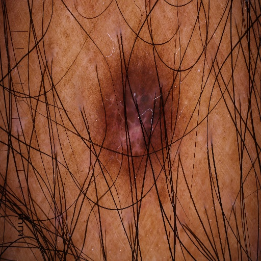
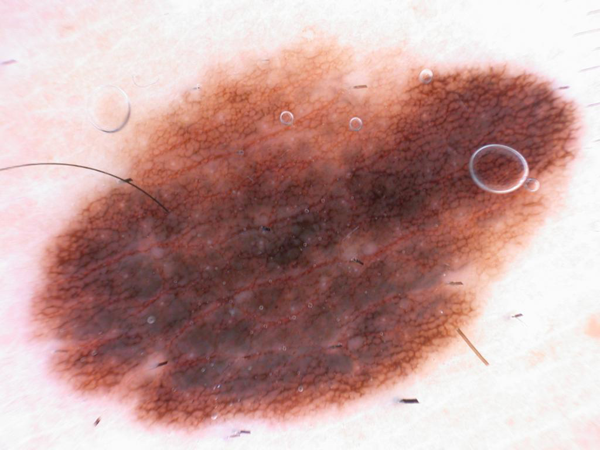
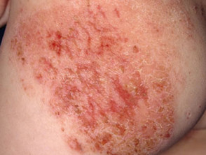

# AI-Powered Skin Disease Detection & Consultation System

A comprehensive deep learning application that detects skin diseases from images and provides AI-powered medical advice using LLMs. This innovative platform leverages **state-of-the-art YOLOv11 computer vision** combined with **advanced LLM capabilities** to deliver intelligent medical insights. Built with modular architecture for scalability and maintainability, it serves as a bridge between patients and dermatological expertise. The system processes skin lesion images in real-time, providing instant disease classification with confidence metrics and personalized AI-generated medical recommendations. Perfect for healthcare applications, educational purposes, and preliminary self-assessment of skin conditions.

###  Sample Skin Images from Dataset

<div align="center">
  <table>
    <tr>
      <td align="center"><br/><b>Melanoma</b></td>
      <td align="center"><br/><b>Melanocytic Nevi</b></td>
      <td align="center"><br/><b>Seborrheic Keratoses</b></td>
    </tr>
  </table>
</div>

---

##  Live Demo

**Try the application online:** [ AI-Powered Skin Disease Detection System](https://ai-powered-skin-disease-detection-consultation-system.streamlit.app/)

No installation required! Upload an image and get instant disease detection with AI medical advice.

---

## Table of Contents

- [Project Overview](#project-overview)
- [Problem Statement](#problem-statement)
- [Key Features](#key-features)
- [Architecture & Workflow](#architecture--workflow)
- [Dataset Structure](#dataset-structure)
- [Installation & Setup](#installation--setup)
- [Project Structure](#project-structure)
- [Usage Guide](#usage-guide)
  - [1. Data Preparation](#1-data-preparation)
  - [2. Model Training](#2-model-training)
  - [3. Making Predictions](#3-making-predictions)
  - [4. Web Application](#4-web-application)
- [Configuration](#configuration)
- [Technologies Used](#technologies-used)
- [Troubleshooting](#troubleshooting)
- [Future Enhancements](#future-enhancements)

---

##  Project Overview

This project combines **YOLOv11 image classification** with **LLM-powered medical advice** to create an intelligent skin disease detection system. Users can upload skin lesion images, receive instant disease predictions with confidence scores, and get detailed AI-generated medical consultation.

**Key Capabilities:**
-  Detect 10 different skin diseases
-  Classification confidence scoring
-  AI-generated medical advice using Groq LLM
-  Interactive web interface with Streamlit
-  Multi-stage training pipeline

---

##  Problem Statement

Dermatological conditions affect millions worldwide, but access to expert medical consultation is limited. This project addresses:

1. **Accessibility**: Enabling preliminary skin disease identification without visiting a dermatologist
2. **Speed**: Instant analysis of skin lesion images
3. **Guidance**: Providing actionable medical advice and next steps
4. **Education**: Helping users understand skin conditions

---

##  Key Features

| Feature | Description |
|---------|-------------|
| **Disease Detection** | Classifies 10 skin diseases with high accuracy |
| **Confidence Scoring** | Provides probability confidence for each prediction |
| **LLM Integration** | Groq LLM generates detailed medical advice |
| **Interactive UI** | Streamlit-based user-friendly web interface |
| **Multi-format Input** | Supports JPG, JPEG, PNG image formats |
| **Session Management** | Tracks predictions and advice in conversation history |
| **Real-time Processing** | Instant image analysis and response generation |

---

##  Architecture & Workflow

### End-to-End Pipeline

```
┌──────────────────┐
│   Raw Dataset    │
│   (10 Classes)   │
└────────┬─────────┘
         │
         ▼
┌──────────────────┐
│  Data Splitting  │ ◄─── data_split.py
│  (80/20 split)   │
└────────┬─────────┘
         │
         ▼
┌──────────────────┐
│ Processed Data   │
│  (train + val)   │
└────────┬─────────┘
         │
         ▼
┌──────────────────┐
│  YOLOv11 Train   │ ◄─── train.py
│   (CPU/GPU)      │
└────────┬─────────┘
         │
         ▼
┌──────────────────┐
│  Best Model      │
│   (best.pt)      │
└────────┬─────────┘
         │
         ▼
    ┌────────────────────────────┐
    │   User Input (Image)       │
    └────────┬───────────────────┘
             │
    ┌────────▼──────────┐
    │   Predictor       │ ◄─── predictor.py
    │   (Disease + %)   │
    └────────┬──────────┘
             │
    ┌────────▼──────────────┐
    │  LLM Advice Generator │ ◄─── llm_advice.py
    │  (Groq LLM)          │
    └────────┬──────────────┘
             │
             ▼
    ┌──────────────────┐
    │  Final Output    │
    │  (Advice + Chat) │
    └──────────────────┘
```

### Module Responsibilities

| Module | Purpose |
|--------|---------|
| `config.py` | Central configuration management |
| `data_split.py` | Dataset preprocessing and train/val splitting |
| `train.py` | Model training using YOLOv11 |
| `predictor.py` | Image classification and disease detection |
| `llm_advice.py` | LLM integration for medical advice generation |
| `main.py` | CLI-based disease analysis script |
| `streamlit_app.py` | Interactive web application |

---

##  Dataset Structure

### Supported Skin Diseases

```
data/
├── raw/IMG_CLASSES/
│   ├── 1. Eczema
│   ├── 2. Melanoma
│   ├── 3. Atopic Dermatitis
│   ├── 4. Basal Cell Carcinoma (BCC)
│   ├── 5. Melanocytic Nevi (NV)
│   ├── 6. Benign Keratosis-like Lesions (BKL)
│   ├── 7. Psoriasis/Lichen Planus
│   ├── 8. Seborrheic Keratoses
│   ├── 9. Tinea/Ringworm/Candidiasis
│   └── 10. Warts/Molluscum/Viral Infections
│
└── processed/
    ├── train/  (80% of data)
    └── val/    (20% of data)
```

### Dataset Statistics

- **Total Classes**: 10 skin diseases
- **Train/Val Split**: 80/20
- **Image Size**: 224×224 pixels
- **Formats Supported**: JPG, JPEG, PNG

---

##  Installation & Setup

### Prerequisites

- Python 3.8+
- CUDA 11.0+ (optional, for GPU acceleration)
- 4GB+ RAM

### Step 1: Clone & Navigate

```bash
cd e:\Educational\ Material\Deep\ Learning\ \&\ Generative\ AI\Projects\skin_ai_chatbot
```

### Step 2: Create Virtual Environment

```bash
# Windows (PowerShell)
python -m venv .venv
.\.venv\Scripts\Activate.ps1

# Mac/Linux
python3 -m venv .venv
source .venv/bin/activate
```

### Step 3: Install Dependencies

```bash
pip install -r requirements.txt
```

### Step 4: Configure API Keys

Create a `.env` file in the project root:

```env
GROQ_API_KEY=your_groq_api_key_here
```

Get your Groq API key from: https://console.groq.com/

### Step 5: Verify Installation

```bash
python -c "from ultralytics import YOLO; print(' YOLO loaded')"
python -c "from langchain_groq import ChatGroq; print(' LangChain loaded')"
```

---

##  Project Structure

```
skin_ai_chatbot/
│
├── 📄 README.md                          # Project documentation
├── 📄 requirements.txt                   # Python dependencies
├── 📄 config.py                          # Central configuration
├── 📄 .env                               # API keys (create this)
│
├──  MODULES
│   ├── data_split.py                     # Dataset preprocessing
│   ├── train.py                          # Model training
│   ├── predictor.py                      # Prediction engine
│   ├── llm_advice.py                     # LLM integration
│   ├── main.py                           # CLI interface
│   └── streamlit_app.py                  # Web application
│
├──  DATA
│   ├── raw/
│   │   └── IMG_CLASSES/                  # Original dataset
│   │       ├── 1. Eczema 1677/
│   │       ├── 2. Melanoma 15.75k/
│   │       └── ... (8 more classes)
│   │
│   └── processed/
│       ├── train/                        # Training data (80%)
│       └── val/                          # Validation data (20%)
│
├──  MODELS
│   ├── yolo11n-cls.pt                    # Pre-trained YOLOv11 nano
│   └── images/                           # Test images
│
└──  RESULTS
    └── runs/classify/train/
        ├── best.pt                       # Best trained model
        ├── last.pt                       # Last checkpoint
        ├── args.yaml                     # Training arguments
        └── results.csv                   # Training metrics
```

---

##  Usage Guide

### 1. Data Preparation

#### Why Data Splitting?
The raw dataset needs to be split into training and validation sets to:
- Train the model effectively
- Evaluate generalization performance
- Avoid data leakage

#### Execute Data Splitting

```bash
python data_split.py
```

**What it does:**
-  Loads all images from `data/raw/IMG_CLASSES/`
-  Recursively finds images in subdirectories
-  Splits each class 80% → train, 20% → val
-  Organizes into `data/processed/`

**Expected Output:**
```
Dataset Path: data/raw/IMG_CLASSES
1. Eczema 1677: 1677 images
2. Melanoma 15.75k: 15750 images
...
[TRAIN] images copied: 39200
[VAL] images copied: 9800
 Dataset split completed!
```

---

### 2. Model Training

#### Training Configuration

All training parameters are in [config.py](config.py):

```python
IMG_SIZE = 224          # Input image size
EPOCHS = 100            # Training epochs
BATCH_SIZE = 16         # Batch size per iteration
TRAINED_MODEL_PATH = "runs/classify/train/weights/best.pt"
```

#### Start Training

```bash
python train.py
```

**What it does:**
-  Loads YOLOv11 nano model (pre-trained on ImageNet)
-  Fine-tunes on your skin disease dataset
-  Saves best model weights during training
-  Generates training metrics and visualizations

**Expected Output:**
```
 Training started...
Epoch 1/100: loss=2.341, accuracy=0.754
Epoch 2/100: loss=1.892, accuracy=0.823
...
Epoch 100/100: loss=0.234, accuracy=0.987
 Training completed!
Best model saved: runs/classify/train/weights/best.pt
```

**Training Time:**
- CPU: ~2-4 hours
- GPU (CUDA): ~30-60 minutes

---

### 3. Making Predictions

#### Understanding the Predictor Module

The [predictor.py](predictor.py) module handles image classification:

```python
Predictor()              # Initialize with best model
  ├── predict(image_path)
  │   ├── Load image
  │   ├── Run inference
  │   ├── Extract disease name
  │   └── Return (disease, confidence)
```

#### CLI-Based Prediction

```bash
python main.py
```

**What it does:**
1. Loads test image from `images/5.jpg`
2. Runs disease detection
3. Generates LLM advice
4. Prints formatted output

**Example Output:**
```
 Detected Disease: Melanoma
Confidence: 0.94

 AI Medical Advice:

Explanation:
Melanoma is the most dangerous type of skin cancer...

Treatment:
Early detection is crucial. Treatment options include:
- Surgical excision...
- Chemotherapy...

Next Steps:
1. Consult a dermatologist immediately
2. Get a biopsy...

Daily Tips:
- Protect from UV exposure
- Monitor changes...
```

#### Programmatic Usage

```python
from predictor import Predictor
from llm_advice import generate_advice

predictor = Predictor()

# Predict disease
disease, confidence = predictor.predict("path/to/image.jpg")

# Generate advice
advice = generate_advice(disease)

print(f"Disease: {disease} ({confidence:.2%})")
print(f"Advice:\n{advice}")
```

---

### 4. Web Application

#### Streamlit Interface

Launch the interactive web application:

```bash
streamlit run streamlit_app.py
```

**What it provides:**
-  Image upload interface
-  Real-time disease detection
-  Multi-turn conversation with AI
-  Confidence score visualization
-  Session-based history

#### Features

| Feature | Details |
|---------|---------|
| **Upload** | Drag & drop or select JPG/PNG |
| **Analyze** | Click "🔍 Generate" to analyze |
| **Chat** | Ask follow-up questions |
| **History** | View previous predictions |

#### Interface Layout

```
┌─────────────────────────────────────┐
│   AI-powered skin disease detection │
├─────────────────────────────────────┤
│                                     │
│  📤 Upload Image                    │
│  [Upload Box]                       │
│                                     │
│  🔍 Generate                        │
│  [Button]                           │
│                                     │
│  Disease: Melanoma                  │
│  Confidence: 94%                    │
│                                     │
│  💡 Medical Advice:                 │
│  [LLM Generated Content]            │
│                                     │
│  💬 Chat with AI:                   │
│  [Conversation History]             │
│  [User Input Box]                   │
└─────────────────────────────────────┘
```

#### Session State Management

```python
st.session_state
├── disease         # Detected disease name
├── confidence      # Prediction confidence
├── advice          # Generated advice
├── messages        # Chat history
└── image           # Uploaded image
```

---

##  Configuration

### [config.py](config.py) - Central Configuration Hub

```python
# 📁 Data Paths
DATASET_PATH = "data/raw/IMG_CLASSES"      # Raw dataset location
OUTPUT_PATH = "data/processed"              # Processed dataset location

# 🔀 Data Split
SPLIT_RATIO = 0.8                           # 80% train, 20% val

# 🤖 Model Configuration
MODEL_NAME = "yolo11n-cls.pt"               # Base model
TRAINED_MODEL_PATH = "runs/classify/train/weights/best.pt"

# 📊 Training Parameters
IMG_SIZE = 224                              # Input image size
EPOCHS = 100                                # Training epochs
BATCH_SIZE = 16                             # Batch size
```

### Environment Variables - [.env](.env)

```env
GROQ_API_KEY=gsk_xxxxxxxxxxxxxxxxxxxxx
```

**Where to get API keys:**
1. Visit: https://console.groq.com/
2. Sign up / Log in
3. Create new API key
4. Copy to `.env` file

---

##  Technologies Used

### Deep Learning & Computer Vision
| Tool | Purpose | Version |
|------|---------|---------|
| **YOLOv11** | Image classification model | Latest |
| **Ultralytics** | YOLO framework | Latest |
| **PyTorch** | Deep learning backend | 2.0+ |

### LLM & NLP
| Tool | Purpose | Details |
|------|---------|---------|
| **Groq LLM** | Medical advice generation | llama-3.1-8b-instant |
| **LangChain** | LLM orchestration | Latest |
| **python-dotenv** | Environment variables | Latest |

### Web & UI
| Tool | Purpose | Details |
|------|---------|---------|
| **Streamlit** | Web application framework | 1.0+ |

### Python Ecosystem
- **Python**: 3.8+
- **Package Manager**: pip

---

##  Troubleshooting

### Issue 1: GROQ API Error
```
Error: GROQ_API_KEY not found
```

**Solution:**
1. Check `.env` file exists in project root
2. Verify API key format: `GROQ_API_KEY=gsk_xxxxx`
3. Test connection:
   ```bash
   python -c "import os; print(os.getenv('GROQ_API_KEY'))"
   ```

---

### Issue 2: Model Not Found
```
Error: No such file or directory: 'runs/classify/train/weights/best.pt'
```

**Solution:**
1. Train model first: `python train.py`
2. Wait for training to complete
3. Verify model exists: `ls runs/classify/train/weights/`

---

### Issue 3: Out of Memory (OOM)

**Solution:**
- Reduce `BATCH_SIZE` in [config.py](config.py) to 8 or 4
- Use GPU if available
- Close other applications

---

### Issue 4: Image Upload Fails in Streamlit
```
Error: File type not supported
```

**Solution:**
1. Ensure image is JPG, JPEG, or PNG
2. Check image file is not corrupted
3. Try different image format
4. Clear Streamlit cache: `streamlit cache clear`

---

### Issue 5: Slow Prediction

**Solution:**
- **CPU**: Use GPU if available or reduce image size
- **GPU**: Check CUDA availability: `nvidia-smi`
- **Model**: Consider using smaller model variant

---

##  Future Enhancements

### Phase 2: Model Improvements
- [ ] Add more skin disease classes
- [ ] Implement ensemble methods
- [ ] Add uncertainty estimation
- [ ] Support for multiple images batch processing

### Phase 3: Features
- [ ] Medical history tracking
- [ ] Doctor recommendation system
- [ ] Severity level classification
- [ ] Multi-language support

### Phase 4: Deployment
- [ ] Docker containerization
- [ ] Cloud deployment (AWS/GCP/Azure)
- [ ] Mobile app (React Native/Flutter)
- [ ] API endpoint (FastAPI/Flask)

### Phase 5: Integration
- [ ] Electronic Health Records (EHR) integration
- [ ] Appointment booking system
- [ ] Insurance provider integration
- [ ] Telemedicine consultation booking

---

##  Support

For issues or questions:
1. Check [Troubleshooting](#troubleshooting) section
2. Review [Usage Guide](#usage-guide)
3. Check configuration in [config.py](config.py)
4. Verify `.env` file setup

---

##  Disclaimer

 **Important**: This system is designed for **educational and preliminary screening purposes only**. It should NOT replace professional medical diagnosis. Always consult with a qualified dermatologist for accurate diagnosis and treatment.

---

##  License

This project is for educational purposes.

---

##  Acknowledgments

- **Dataset**: HAM10000 & ISIC skin disease dataset
- **Model**: Ultralytics YOLOv11
- **LLM**: Groq LLM API
- **Framework**: Streamlit

---

**Last Updated**: April 2026  
**Md Atickur Rahman**\
**contact**: 01849647396\
**mail**: atickft13129@gmail.com
